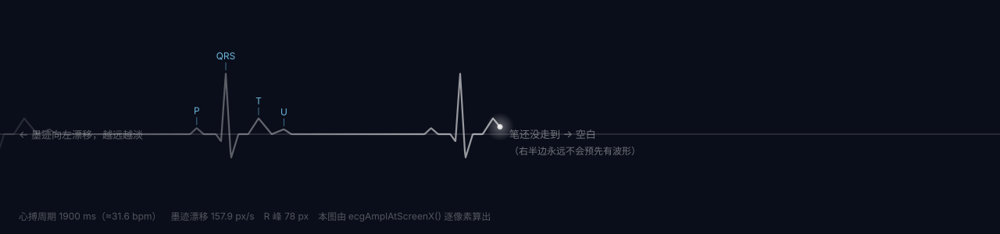
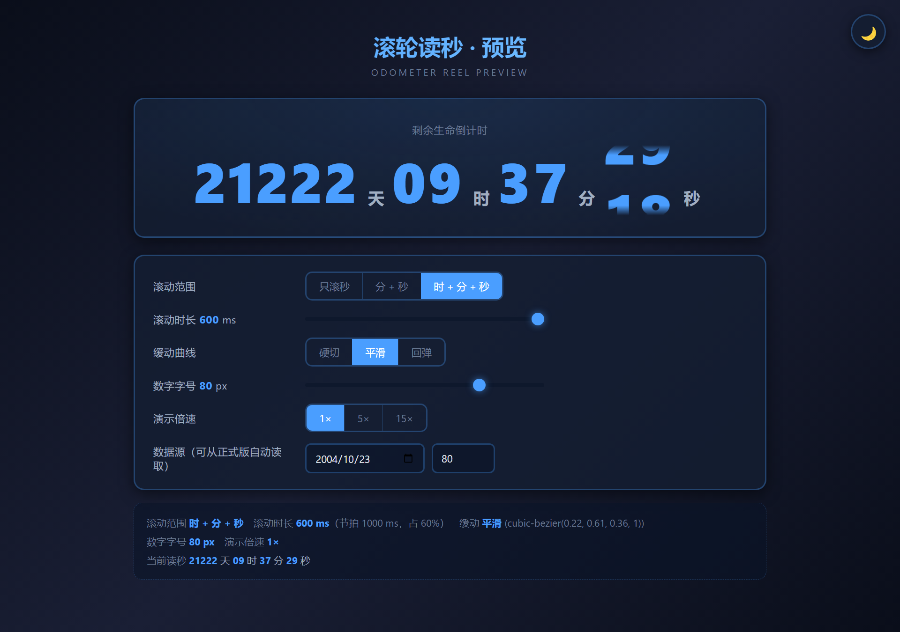

<div align="center">

# 🚀 人生倒计时 · Life Countdown

**把「剩下的时间」画成一条心电图**

输入出生日期和预期寿命，它把余生拆成天、时、分、秒，并在背景上画一条**会心跳**的心电曲线。


</div>

---

## 心跳线：波不是「铺」在那里的，是「长」出来的

大多数倒计时 App 的装饰性波形，本质是一张**会滚动的壁纸**：波形永远铺满整屏，再把一个小光点放上去骑着它跑。

真实的 ECG 不是这样。**心脏先电激动，描记笔才在纸上拖出波形**。所以这里做成了「笔尖描记」模型：

- 屏幕正中一颗**笔尖**（发光点）。心脏每搏动一次，笔尖才当场描出一个波形包；
- 描下的墨迹**留在原地**，以 157.9 px/s 缓慢向左漂移，像纸上干掉的旧墨迹——越远越淡；
- 笔尖**还没走到的右半边是空的**（连波形都没有）。所以启动的第一秒，屏幕是干净的，波形是一拍一拍「长」出来的；
- 想手动来一下？**点画面任意处，当场「咚」一下**，并伴随一圈从笔尖荡开的脉冲。

波形本身照着标准 12 导联心电图的长相来（P 波 → PR 段 → QRS 波群 → ST 段 → T 波 → U 波）：

| 波形 | 相位 | 振幅系数 | 含义 |
|---|---|---|---|
| **P** | 0.048 | `+0.10` | 心房除极，小丘 |
| **PR 段** | 0.078–0.130 | `0` | 回到基线，等激动传到心室 |
| **Q** | 0.152 | `−0.12` | QRS 前的小下陷 |
| **R** | 0.172 | **`+1.00`** | 最高尖峰 ← **「咚」的就是这一下** |
| **S** | 0.194 | `−0.40` | 紧跟其后的深谷 |
| **ST 段** | 0.226–0.268 | `0` | 回到基线 |
| **T** | 0.312 | `+0.26` | 心室复极，小丘 |
| **U** | 0.420 | `+0.08` | 常被忽略的小丘 |

> 图里的 `docs/ecg-waveform.svg` 不是手画的，是 `npm run figure` 跑的 —— 脚本会从 `script.js` 里**把同一份纯函数整块抽出来**逐像素算，所以参数一改图就跟着变，不会和代码对不上。



---

## 功能

- **余生倒计时（滚轮读秒）**：从今天算到「出生日期 + 预计寿命」那一秒；时/分/秒 逐位像机械里程表那样翻牌，天是静态大数字
- **人生进度条**：`已度过年龄 / 预计寿命`
- **健康风险提示**：预计寿命 ≥ 70 岁时给出心血管、睡眠、亚健康等条目
- **心跳线**：见上，笔尖描记式 ECG + 点击手动「咚」
- **明暗双主题**：右上角一键切换，选择记在 localStorage 里
- **数据本地留存**：关掉再打开，倒计时接着走

---

## 快速开始

```bash
npm install
npm start          # 启动 Electron
npm run build      # 打包成 Windows 安装包（electron-builder / NSIS）
npm run verify     # 107 条离线验收断言（心跳线 53 + 滚轮读秒 54，见下）
npm run verify:dom # 15 条真渲染核对：在 Electron 里逐拍比对滚轮显示的数字（会短暂弹窗）
npm run figure     # 重新生成 docs/ecg-waveform.svg
npm run shot       # 重新生成 docs/screenshot.png + 读秒行 17 档版式体检（需图形界面）
npm run shot:odo   # 滚轮预览页：逐根滚轮核对 + 重新生成 docs/odometer-rolling.png
```

> `npm start` 和最后三条都要起 Electron，统一走 `scripts/electron-run.mjs` 这层垫片 ——
> 它会先擦掉 `ELECTRON_RUN_AS_NODE`（那个变量会让 electron 退化成纯 Node：
> 你打 `electron -v` 会得到 Node 的版本号，而应用报
> `require('electron').app is undefined`），省得你换台机器就踩。

没有 Electron 环境，也可以直接开 `index.html` —— 它不依赖任何 Node 能力，就是个普通网页。

### 自带验收：`npm run verify`

不自测的项目不值得信。这个脚本**不再把算法重写一遍**，而是从 `script.js` 里把标记为 `ECG_PURE_MATH` 的纯函数块**整块抽出来跑**，验的是真实现：

| 区 | 内容 | 举例 |
|---|---|---|
| A 代码卫生 | 不可达函数是否残留、id 是否与 HTML 对得上 | 12 个 `getElementById` 全部命中 |
| B 日期逻辑 | 固定 `now` 跑年龄/终点/时长 | 生日当天算已满；终点落在本地 00:00 |
| C 心跳线 | 常量自洽、波形形态、**t=0 整屏空白**、真扫描测节律 | 10 s 扫出 5 个 R 峰，间隔全为 1.900 s |
| D 预览页一致性 | 心跳纯函数块是否与 `heartbeat-preview.html` 逐字一致 | 一旦漂移就报红，沙盒读数不再可信 |

期望值全部**从源码常量推导**（不写死数字），所以你改了 `ECG_PERIOD_MS` 之类的参数，这个脚本照样有效。

`scripts/verify-odometer.mjs`（另 54 条）专验滚轮读秒的纯函数：从 `script.js` 抽同一块 `ODO_PURE_MATH`，模拟从「1 天 02:03:04」逐秒倒着走完 **93,784 秒**，断言 6 根滚轮**每一位显示的永远是真实数字**、每次步进恰好 1 格（含十位回绕），并核对 `odometer-preview.html` 里那份拷贝与正式版**逐字一致**。

其中一组专盯「大跳落位」的判定：早先写的是 `delta >= cycle`（想表达"一次跳了整圈以上就别滚"），可 `odoReelDelta` 末尾带 `% cycle`，返回值天生被封在 `[0, cycle-1]` —— **那条分支从来没执行过**。现在改成按时间差判定（距上次喂值超过 3 s 就当作休眠唤醒 / 页面挂起，直接落位不滚），并加了穷举断言，把「旧门槛数学上不可达」这件事钉死，免得哪天又被改回去。

### 真渲染核对：`npm run verify:dom`

纯函数对了不等于接线对了。「滚轮真的接到了 `updateCountdown` 上」「节拍真的对齐整秒」「CSS 变量真的生效」只能在真渲染进程里量。这个脚本在 Electron 里跑 `index.html`，**逐拍从 `transform` 反推每根滚轮停在第几格、读出那格的文字，跟真实读数比**：

- **确定性核对**（隐藏窗口 + 禁过渡）：核对的 152 帧里目标值 **100%** 等于真实读数
- **动画态核对**（把窗口短暂显示出来让动画真跑）：**1145 个停稳样本 0 次例外**；秒个位滚动占比 46%、停稳 54% —— 证明 600 ms 确实在 1 s 内跑完
- **节拍相位**：5 次翻牌全部贴着整秒边界，最大偏移 56 ms

> 需要图形界面，且会弹出一个窗口约 6 秒 —— 因为隐藏窗口里 CSS 过渡的时间线根本不推进（原因见文末工程笔记 6）。

---

## 读秒：为什么用「滚轮」，以及为什么不能照搬那个 CSS 版

视觉语言借自 CodePen 上的 *CSS-Only Countdown Clock*（kindofone / Yogev Ahuvia）：竖向滚轮长条 + 窄视窗裁切。但那套设计的**驱动是写死的** —— 每位数字的 `animation-duration` / `iteration-count` 在页面加载那一刻就定死（1 小时 = 分钟十位 `3600s × 1`、秒个位 `10s × 360`），所以它没法对准真实时钟、没法设成任意时长、也没有归零。

这里只搬它的**视觉**，驱动换成 JS：滚轮永远由真实读数喂，所以屏幕上的数字任何时候都是对的。



> 上图截的是滚轮**滚到一半**的那一瞬间：相邻两个数字各露一半 —— 这正是"机械里程表"和"直接换字"的区别。图由 `npm run shot:odo` 生成（它会先把过渡冻住、再手动把秒的两根滚带各推半格，所以可复现）。

| | 那套设计 | 这里 |
|---|---|---|
| 起点 | 页面加载那一刻 | 本地 `00:00` 的终点，**对准真实时钟** |
| 时长 | 写死 1 小时 | 约 21,000 天 |
| 归零 / 重设 | 没有 | 有 |

定稿参数（在 `odometer-preview.html` 上挑的）：

| 参数 | 现值 | 说明 |
|---|---|---|
| 滚动范围 | 时 + 分 + 秒 | 天一天才动一次，滚它没意义还吵 → 保持静态数字 |
| 滚动时长 | `600 ms` | 一拍 1000 ms，留 400 ms 停稳 |
| 缓动 | 平滑 `cubic-bezier(.22,.61,.36,1)` | |
| 数字字号 | `80 px` | 窄窗口会自动收紧，见下 |

**每位数字的「圈长」不是都 10 格。** 个位是 0–9 十格轮；分/秒的**十位只有 0–5 六格**；小时的**十位只有 0–2 三格**。这是整套逻辑里最容易写错的地方：若把十位也当十格轮，秒从 `00` 跳 `59` 时十位要走 `0→5` 五格，糊成一片还方向乱。按各自圈长建模后，**每一次步进永远恰好 1 格**，跟机械里程表一样匀速。

**一处诚实的残留**：天进位那一刻小时 `00→23`，个小时位要走 7 格（`delta = (0-3+10)%10 = 7`）。这是真进位、每天只发生一次，机械计数器也这么走 —— 所以留着，没做特殊处理。

**字号为什么要跟着窗口收**：滚动行是**固定格宽**的，塞不下不会自己缩小、只会换行。实测反推出整行宽 ≈ **9.14 × 字号**，于是字号取 `min(80px, 8.2vw)`；窗口内容区 ≥ 976 px 时正好吃满 80 px。（预览页用的是同一条曲线，只有系数略小到 `8.1vw` —— 它的卡片比正式版窄一点，8.2 会顶到边。）`npm run shot` 会在 17 档窗宽（含每个媒体查询边界两侧）上量「nowrap 实测宽 vs 可用宽」，全部单行不溢出才算过。

**节拍对齐整秒**：读数本来只是 `setInterval(…, 1000)`，那样第一拍会落在「启动后第 N 毫秒」这个随机相位上，滚轮看着总慢半拍。改成先 `setTimeout` 到下一个整秒边界再起 `setInterval` —— 滚轮于是总在秒真正翻牌的那一刻开始滚（实测相位偏移 ≤ 56 ms）。

---

## 调参：把心跳调成你喜欢的样子

所有参数集中在 `script.js` 顶部，注释里写了各自作用：

| 参数 | 现值 | 作用 |
|---|---|---|
| `ECG_PERIOD_MS` | `1900` | 心搏周期，越大越慢（1900 ms ≈ **31.6 bpm**，一种「弱弱的心跳」） |
| `ECG_AMPL` | `78` | R 峰高度（px） |
| `ECG_PEN_FRAC` | `0.5` | 笔尖水平位置（0 = 最左，1 = 最右） |
| `ECG_BEAT_W` | `300` | 一次心搏占多少屏幕宽度（px），漂移速度由它和周期推出 |
| `ECG_FIRST_BEAT` | `0.55` | 首拍延迟（秒），先静一息再「咚」 |
| `ECG_PULSE_MS` | `620` | 「咚」的脉冲圈时长（ms） |

不想改代码试参数，开 **`heartbeat-preview.html`** —— 独立预览页，有「更慢 / 更快 / 复位 / 清空重来 / 手动咚」，并实时显示笔尖位置、已印下心搏数、实测心搏间隔。挑好节奏再把数值填回 `script.js`。

---

## 目录结构

```
life-countdown/
├─ main.js                 Electron 主进程（窗口、图标、安全基线）
├─ index.html              界面结构
├─ style.css               太空舱风格样式 + 双主题变量
├─ script.js               业务逻辑
│   ├─ 心跳线（笔尖描记式 ECG）  ← 本项目的核心
│   ├─ 读秒滚轮（odometer）+ 拍点对齐整秒
│   └─ 倒计时 / 年龄 / 进度 / 健康提示
├─ heartbeat-preview.html  心跳线调参预览页（开发用）
├─ odometer-preview.html   滚轮读秒调参预览页（开发用）
├─ scripts/
│   ├─ verify.mjs          验心跳线 / 日期 / 代码卫生 / 预览页一致性（npm run verify）
│   ├─ verify-odometer.mjs 验滚轮读秒纯函数：93,784 秒长跑仿真（npm run verify）
│   ├─ verify-countdown-dom.js  真渲染核对：逐拍比对滚轮显示的数字（npm run verify:dom）
│   ├─ electron-run.mjs    起 Electron 的垫片：先擦掉 ELECTRON_RUN_AS_NODE 再启动
│   ├─ gen-ecg-svg.mjs     从 script.js 抽真实实现 → 生成 README 示意图（npm run figure）
│   ├─ screenshot.js       起 Electron 截图 + 读秒行 17 档版式体检（npm run shot）
│   └─ shot-odometer.js    滚轮预览页：逐根滚轮核对 + 「滚到一半」截图（npm run shot:odo）
├─ docs/
│   ├─ ecg-waveform.svg    自动生成的波形示意
│   ├─ screenshot.png      自动生成的界面截图（暗色）
│   └─ odometer-rolling.png 读秒滚轮「滚到一半」的截图
├─ icon.png / icon.ico     应用图标
└─ package.json
```

---

## 工程笔记：几处容易被忽略的取舍

**1. 日期按本地时区解析，不用 `new Date('2005-03-15')`**

`new Date('YYYY-MM-DD')` 会按 **UTC 午夜**解析，在东八区就变成当天 08:00 —— 倒计时终点整体偏 8 小时。所以手动拆字段构造本地 `00:00`：

```js
function parseLocalDate(str) {
  const [y, m, d] = String(str).split('-').map(Number);
  return new Date(y, m - 1, d);
}
```

**2. 年龄只在「今年生日还没到」时减 1**

```js
if (monthDiff < 0 || (monthDiff === 0 && dayDiff < 0)) age--;
```

注意这里用的是**用户选择的出生日期**去推年龄，而不是让用户自己填年龄 —— 手填年龄再叠加生日判断，很容易多算或少算一整年。

**3. 全屏画布只有一个 rAF 主循环独占**

心跳线每帧 `clearRect` 整个画布。如果有第二个定时器也来擦同一块画布，两者会互相抹掉对方的内容，表现为闪烁撕裂。所以动画只有一个入口：`heartbeatFrame()` 末尾 `requestAnimationFrame` 自己。

**4. Electron 保持默认安全基线**

渲染进程是纯前端（Canvas + localStorage），全项目没有一处 `require` / `process` / `__dirname`。既然不用，就没有理由打开 `nodeIntegration` —— 少一个攻击面，而且零收益。

**5. 纯函数区和 DOM 区分开**

`script.js` 里有**两块**用哨兵注释标出的纯函数区，都不引用任何 DOM：

- `// >>> ECG_PURE_MATH_BEGIN` —— 心跳线
- `// >>> ODO_PURE_MATH_BEGIN` —— 滚轮读秒

好处是测试脚本和图生成脚本可以**把这两段整块抽出来跑**，验的是真实现而不是记忆里的实现。代价是必须用脚本搬而不是手抄，否则两份拷贝会悄悄漂移 —— 所以两边各有一条「逐字一致」断言守着：

- `verify-odometer.mjs`：核对 `odometer-preview.html` 那份 `ODO_PURE_MATH` 与正式版逐字一致；
- `verify.mjs` 的 `[D]` 段：核对 `heartbeat-preview.html` 那份 `ECG_PURE_MATH` 与正式版逐字一致。

（心跳预览页原先是在提示里写着"与 script.js 逐字一致"，但它其实是一份**手抄**的副本、没有任何机制保证 —— 话是对的纯属运气好。现在两个预览页都是"整块粘过来 + 断言守着"，那句话才算数。）

**6. 隐藏窗口（`show: false`）里，一整类东西是不动的**

同一件事有三种症状，一开始看像三个 bug，其实同源 —— 窗口不可见时，合成器不产生新帧：

| 症状 | 真相 | 对策 |
|---|---|---|
| 切亮色主题后，背景白了、卡片还是暗的，像 CSS 写砸了 | CSS `transition` 的**时间线冻结**：`getComputedStyle` 一直返回过渡起始值，而没写 `transition` 的属性秒切 → 一个页面同时「切了」和「没切」 | 截图前注入 `* { transition: none !important; animation: none !important; }`，让每张图都是终态 |
| 明明改了样式，截出来的图还是上一张 | `capturePage()` 拿到**旧帧** | 主动 `webContents.invalidate()` + 等几帧 + **用角落像素自检**（暗色背景 ≈17、亮色 ≈247），不对就重试 |
| 逐拍比对滚轮的脚本，6 秒只采到 7 个样本、滚动占比恒为 0% | `requestAnimationFrame` 被节流到 **~1 fps**，而且**过渡根本不推进**（读数永远停在旧格上）。注意定时器不受影响（实测 36/s） | 采样改用 `setTimeout`；要验动画态就把窗口**短暂显示**出来（`showInactive()`） |

这条踩得最狠：第一版 `verify-countdown-dom.js` 就是被这三点骗了，报出「显示 9 期望 7」这种吓人的红 —— 其实是环境造成的假象，代码是好的。所以那个脚本现在分两段跑：**隐藏 + 禁过渡**做确定性核对，**可见窗口**做动画态核对。

另外：环境里若带 **`ELECTRON_RUN_AS_NODE=1`，electron 会退化成纯 Node**，症状是 `require('electron').app` 为 `undefined`。跑之前要 `unset` 掉。

**7. 数字用 `tabular-nums`，跳秒时行宽不抖**

等宽数字（`font-variant-numeric: tabular-nums`）让 `11111` 与 `88888` 同宽，否则每秒变化时整行会左右轻微跳动。`npm run shot` 会顺带断言这一点（实测差值 0 px）。

**8. 断言红了，先分诊「是代码错，还是判据错」**

这个项目里翻红的断言，一大半最后都发现**是我量错了**，不是代码错。真实记录：

| 红了的断言 | 实际原因 |
|---|---|
| 「波形覆盖率单调递增」在平线段报红 | 拿「非零采样点数」当覆盖率 ——波包之间本来就该是平的。**量的是不是我想量的那个东西** |
| 「15× 下滚动时长已钳制」仍报 0% 正确 | 钳制线写成「留节拍的 10%」→ 15× 下只有 6.7 ms，不够一帧。**余量要用绝对量（一帧），不能用比例** |
| 「滚动时长 600ms」量出来是 `0s` | 「禁过渡」那段样式插在了读取之前 —— 自己把要量的东西改掉了 |
| 「每秒步进都是 1 格」报 3600 次例外 | 把「天进位的 7 格」也算进去了。判据要按位分别写，不能笼统 |
| 「所有滚轮都错位」 | 核对时拿字符串和数字直接 `===`，6 根全误报 |
| 「首帧读数是真值」 | 拿 `row.textContent` 当显示值 —— 它把**整条滚带**的文字全拼进去了。量"屏幕上显示什么"必须按**停格**读（从 `transform` 的 `m42` 反推格索引） |
| 「17 档窗宽全部不溢出」 | 见下面第 9 条：有些档其实是在**上一个宽度**上量的 |

以及两条相邻的教训：

- **`Range.getClientRects().length` 不能当行数**、**块的 `getBoundingClientRect().width` 不能当文字宽**（块会撑满父容器）。量文字宽要克隆一份加 `white-space: nowrap` 的探针。
- **逐像素采样必然错过连续极值**（量到 94.5 去对 94.0）—— 容差要按"一像素内的斜率"给，别当成 bug 去改代码。

**9. 量尺寸之前，先确认尺寸真的变了**

版式体检的做法是「把窗口调成 N 档宽度、每档量一次」。但有些环境会**静默忽略** `setContentSize` ——
无窗口管理器的沙箱、远程桌面、某些 CI 都会。后果特别阴：你以为在量 660 px，其实视口还停在 760 px，
**读数看起来完全正常，只是量错了对象**。

实测（同一台机器连续请求）：

| 请求内容宽 | 实测 `window.innerWidth` |
|---|---|
| 1280 / 1100 | 1280 / **1280** |
| 1000 / 900 / 860 | 1000 / **1000** / **1000** |
| 760 / 660 / 560 | 760 / **760** / **760** |

于是 `npm run shot` 的「17 档全部通过」一开始只有 7 档是真量到的，另外 10 档在重复量同一宽度 ——
**一条永远为真的断言，比没有断言更危险**。

修法两层：① 每次改完尺寸先读一次 `window.innerWidth` 自检，对不上就**重试**（重试后 17 档全部真量到）；
② 实在调不动的档标 `SKIP`、**不计入结论**，并且「一档都没量到」按不通过处理 ——
`验不了 ≠ 通过`。`npm run shot:odo` 里也用了同一套。

这份自检还有个副产品：它把预览页在 **900 px** 那档的真实溢出给照出来了（`需 731 / 可用 679`）——
以前那 10 档假读数把这个坑盖住了。根因是预览页的字号只在两个断点上**阶跃**下压（≤880 px → 46 px），
而 `881~976` 这段「刚离开断点、字号还没降够」的窄带没人管。修法与正式版对齐：基础值也改成连续钳制
`min(--digit-want, 8.1vw)`（系数比正式版的 `8.2vw` 略小 —— 本页卡片比正式版窄约 8 px，是实测反推的；
先用 8.2 时 881 px 只剩 1 px 余量，站在刀尖上）。体检档位同时加密到 **15 档**、覆盖两个断点两侧，
现在最紧的一档是 881 px 的 `需 653 / 可用 662`。

---

## License

[MIT](LICENSE)
